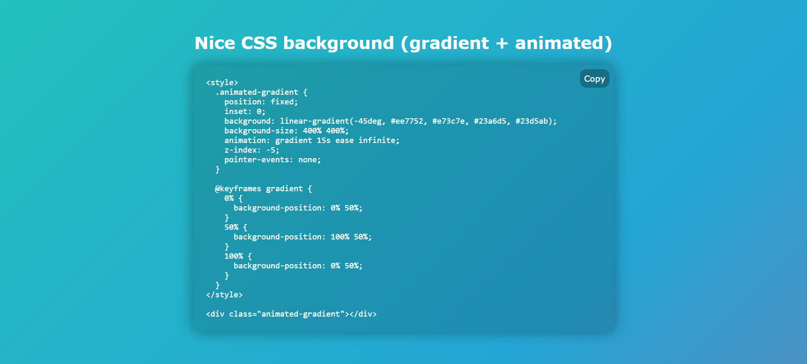

# animated gradient effect

this was made a loooong while back; found this in my old pc just sitting around

there were bugs and deprecated stuff being used which i've cleaned up, but the original forever exists in the initial commit for memory lane trips

that said, [index.html](./src/index.html), [styles.css](./src/styles.css), and [script.js](./src/script.js) are now highly overengineered for no real reason — none of the nostalgia innocence left. quite the glow up or quite tragic — depending on which side of the spectrum you're on

can be viewed at [poran-dip.github.io/gradient](https://poran-dip.github.io/gradient/)

and here's a demo screenshot:

it does actually animate, but the png is too cool to do that. no gif cause the animation is long (15s) — just visit the live link to see it in action
